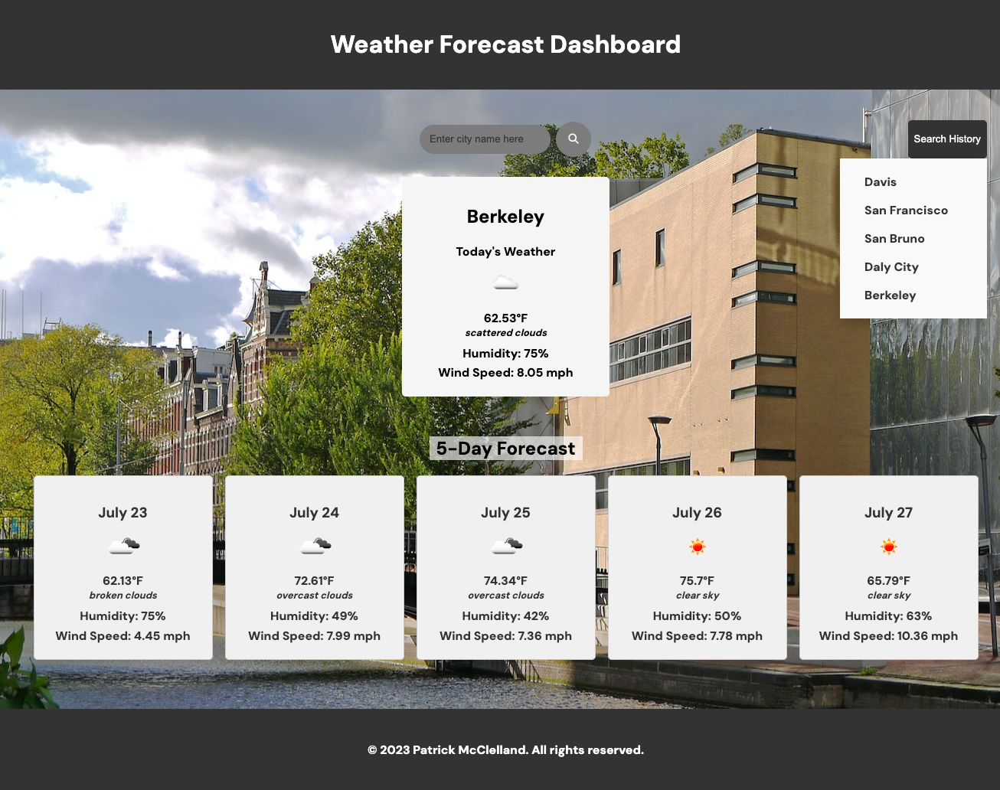

# UC Berkeley Coding Bootcamp - Module 6 Challenge
## Weather Forecast Dashboard
For this project, I am building a weather forecast dashboard that runs in the browser. The dashboard will utilize third-party APIs, specifically the openweather.org API, to access weather data and functionality. By making requests to the API with specific parameters, developers can retrieve weather data from the openweather.org service. The dashboard will feature dynamically updated HTML and CSS, allowing users to view real-time weather information around the world. 

## Table of Contents 
- [User Story](#user-story)
- [Acceptance Criteria](#acceptance-criteria)
- [Installation](#installation)
- [Usage](#usage)
- [Features](#features)
- [Contributing](#contributing)
- [Support](#support)
- [Acknowledgements](#acknowledgements)
- [Authors](#authors)
- [Webpage Screenshot](#webpage-screenshot)
- [Deployed Application](#link-to-deployed-application)

## User Story
AS A traveler
I WANT to see the weather outlook for multiple cities
SO THAT I can plan a trip accordingly

## Acceptance Criteria
GIVEN a weather dashboard with form inputs
WHEN I search for a city
THEN I am presented with current and future conditions for that city and that city is added to the search history
WHEN I view current weather conditions for that city
THEN I am presented with the city name, the date, an icon representation of weather conditions, the temperature, the humidity, and the wind speed
WHEN I view future weather conditions for that city
THEN I am presented with a 5-day forecast that displays the date, an icon representation of weather conditions, the temperature, the wind speed, and the humidity
WHEN I click on a city in the search history
THEN I am again presented with current and future conditions for that city

## Installation
No special installation is necessary to view this project.

## Usage 
This project is intended for education purposes only.

## Features
HTML / CSS / JavaScript

## Contributing
No other contributors have added to this project.

## Support
N/A

## Acknowledgements
N/A

## Authors
Created by Patrick McClelland, UC Berkeley Bootcamp Student

## Link to Deployed Application
To access the deployed application, please click the link below:
https://pmcclelland11.github.io/Weather-Forecast-Dashboard/

## Webpage Screenshot
